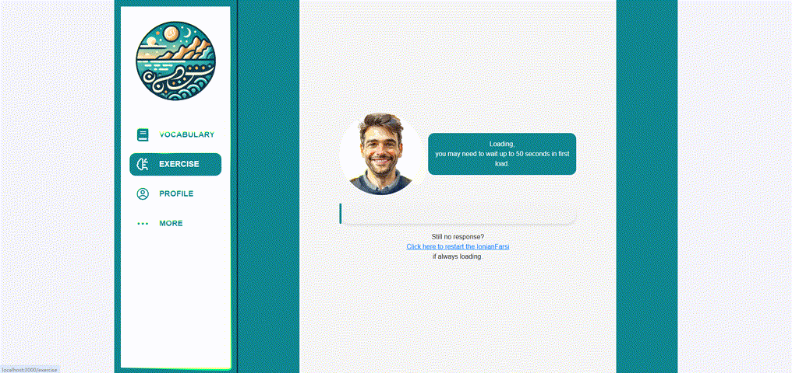
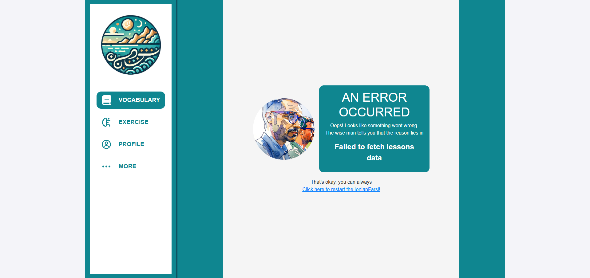
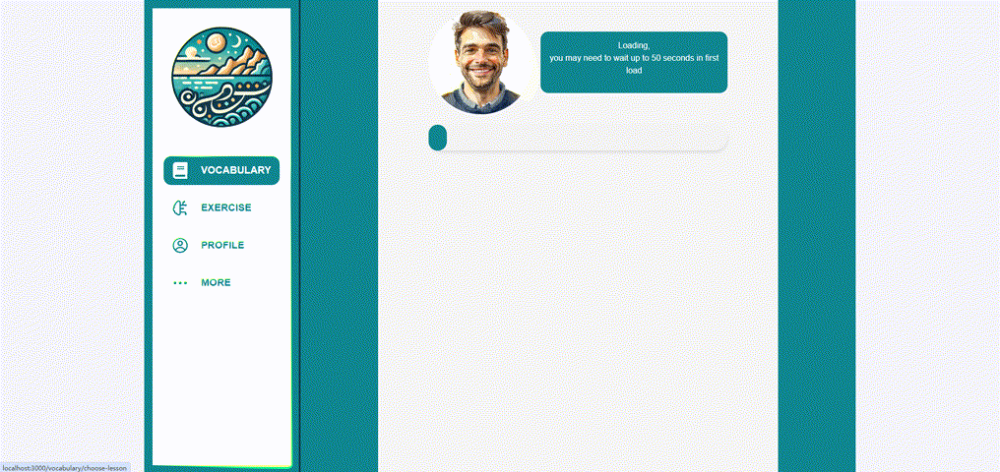
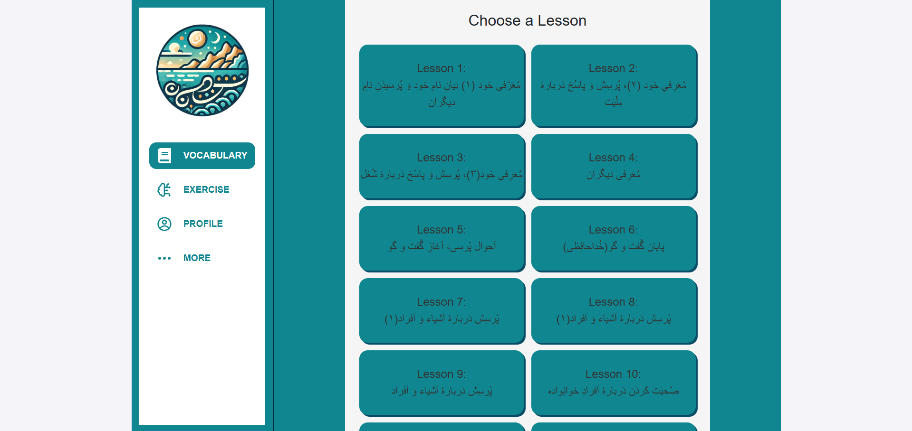

# IonianFarsi - آیونیان فارسی
[http://ionianfarsi.gr/](http://ionianfarsi.gr/)

## Abstract  
IonianFarsi is a multimedia online extracurricular application designed for the learning and reinforcement of the Persian language, utilizing the [1st Step](https://books.saadifoundation.ir/books/en1ststep) book of [Bonyade saadi](https://saadifoundation.ir/en).

---

## Features  
- **Vocabulary**: Interactive Vocabulary following the 1stStep book structure.  
- **Exercises**: Infinite practice exercises for vocabulary reinforcement.

---

## Methodology  
- **Database Setup**: Create a MySQL database with course-related words from the 1stStep book in phpmyadmin.  
- **API Development**: Develop an API for the application's interaction with the database using Node/Express.js.  
- **Front-End Development**: Build the application's user interface using React.js.  
- **Prototyping Model**: Prototyping approach used during development.

---

## Deliverables  
1. Source code of the application (component-based), API, and Database with comments, hosted on [GitHub](https://github.com/Matin-Marzie/IonianFarsi).
2. [Public YouTube video demonstrating](https://youtu.be/ascpUVPeSLw):  
   - Application features  
   - User documentation  
3. Online hosted application:  
   - Hosting: [Netlify](https://www.netlify.com)  
   - Database: [FreeMySQLHosting](https://www.freemysqlhosting.net/)  
   - API: [Render](https://render.com/)
   - Domain name: [papaki.com](https://www.papaki.com/)

---

# IonianFarsi  - آیونیان فارسی (with Power-Up Kit)

## About the Power-Up Kit
The IonianFarsi with Power-Up Kit is the enhanced version of the original. While optimizing the frontend, suggestions were also made to various parts of the entire project. All code modifications are annotated and can be found in the change log below. However, minor changes to the Power-Up Kit code will not be recorded.

## 02/02/2025 Update:
- Updated 01/02/2025 but forgot to record: (Home.css) Optimize home-content h1, with larger font-size and margin-top, and smaller flex-basis.
- (Test.js, App.js) Add a test page for testing. Εννοείται. The directory is named dokimi so that it is not easy to find. Can be set to be accessible to administrators only in the future.
- Standardize naming format in the Power-Up Kit. Does not affect the original parts of code. All additional content in the Power-Up Kit will be marked with the prefix "puk". Non-independent parts will refer to the original naming format but will still follow this rule.
- Loading Page Update: Rename LoadingBar to Loading since it's no longer a simple bar. Adjust loadProgress so that the user can never reach the 100%. Adjust the text description with an interesting effect and add a redirect link to solve a bug mentioned below.
- Error Page Update: Add a new error page instead of just printing the error log. The bugs encountered and temporary solutions are listed below.
- Fix bug: "Failed to fetch ... data" or keep "Loading, you may need to wait up to 50 seconds in first load" if page is inactive for a while; One simple refresh does not solve the problem, but restarting from the home page does. This seems to be solved by adding a redirect link to restart the app on the corresponding page but I'm not sure. Of course, optimizing database connections is the only way to solve the problem once and for all.

## Update Plans:
- Beautify the choose-lesson button and word cards.
- Add scroll bar or pagination in some pages.
- Add Latinized forms of Persian words and store them externally, with a toggle to determine whether to display them.
- Add another home page in the app or copy the original home page.
- Merge LessonNavigator.js and exercise.js.
- StillWorkingOn.js: Page layout can be optimized - but not right now.
- Add other language learning features besides the duolingo style exercise - maybe some traditional mini games - but this plan has lower priority.

## Suggestions:
- Introduce bootstrap to handle css.
- Introduce .env to handle passwords and similar parts.
- Complete the basic user system to store settings.

## 01/02/2025 Update:
- (Home.js, NavigationBar.js, home.css) Change the start page of vocabulary function from vocabulary of lesson 1 to the lesson navigator, so it's the same as the exercise function.
- (NavigationBar.js, LessonNavigator.js, exercise.js, app.css) Add io-text-centerer to center the text.
- (LessonNavigator.js, exercise.js) Adjust line breaks and center the text to beautify the page. For more complex pages and beautification, it is recommended to use css.
- (LoadingBar.js, LoadingBar.css, LessonNavigator.js, Vocabulary.js, Exercise.js, Practice.js, FakePortrait.jpg) Add fake loading progress bar with a fake portrait. :)
- Introduce .gitignore

